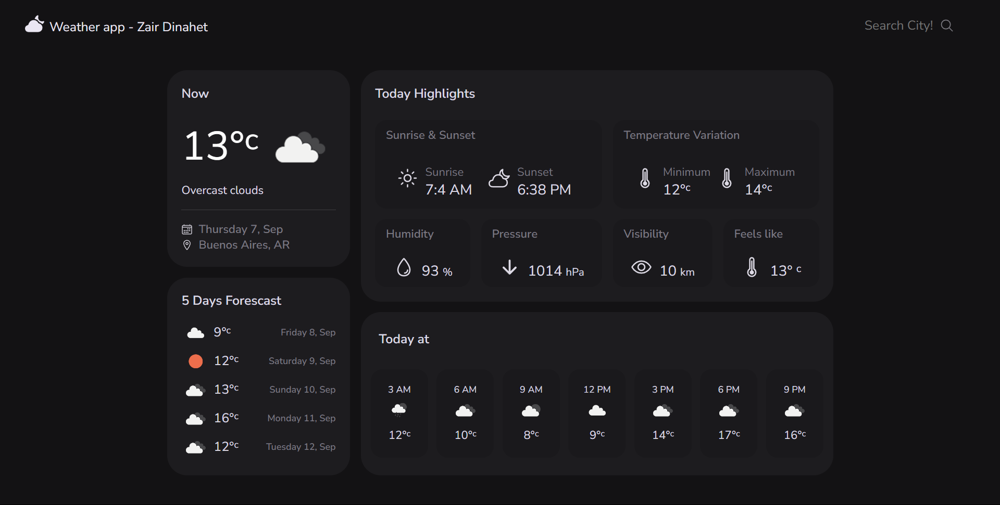

# ⛅ **WeatherApp - Zair Dinahet**

**Small project aimed at facilitating weather information for the user**

**Search for a city located anywhere in the world and let the app display cards with its current weather information. With different images and information according to the data provided by the Open Weather API.**

## 💻 **Used Techonologies**

- **HTML5**
- **CSS Module**
- **JavaScript (ES6)**
- **React**
- **Vite.js**

## 💻 **Installation**

```
🍂 git clone https://github.com/ZairDinahet/weather-app-react.git
🍂 npm install >> Weather-App/
🍂 npm run dev >> Weather-App/
```

## 💻 **Preview**

<p>

</p>
